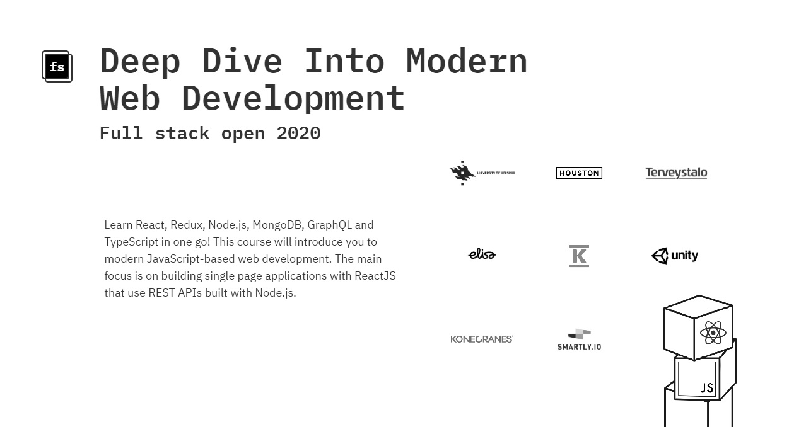

# Course Excercises

- [Part 0: Fundamentals of Web Apps](https://github.com/sehroz/full-stack-open-2020/tree/master/part-0)
- [Part 1: Introduction to React](https://github.com/sehroz/full-stack-open-2020/tree/master/part-1)
- [Part 2: Communicating with Server](https://github.com/sehroz/full-stack-open-2020/tree/master/part-2)
- [Part 3: Programming a Server with NodeJS and Express](https://github.com/sehroz/full-stack-open-2020/tree/master/part-3)
- [Part 4: Testing Express Servers, User Administration](https://github.com/sehroz/full-stack-open-2020/tree/master/part-4)
- [Part 5: Testing React Apps](https://github.com/sehroz/full-stack-open-2020/tree/master/part-5)
- [Part 6: State management with Redux](https://github.com/sehroz/full-stack-open-2020/tree/master/part-6)
- [Part 7: React Router, Custom Hooks, Styling App with CSS and Webpack](https://github.com/sehroz/full-stack-open-2020/tree/master/part-7)
- [Part 8: GraphQL](https://github.com/sehroz/full-stack-open-2020/tree/master/part-8)

#

This course serves as an introduction to modern web application development with JavaScript. The main focus is on building single page applications with ReactJS that use REST APIs built with Node.js. The course also contains a section on GraphQL, a modern alternative to REST APIs. The course covers testing, configuration and environment management, and the use of MongoDB for storing the application’s data. This year's edition of the course contains a new part on TypeScript & React Native.

